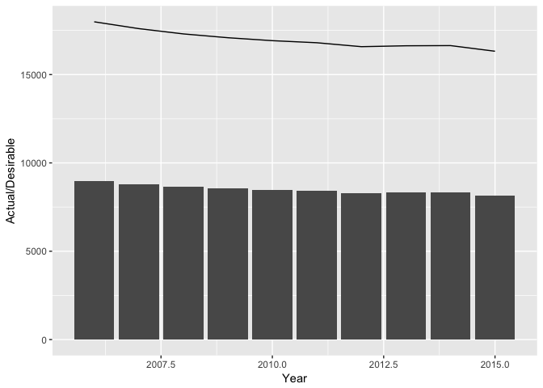
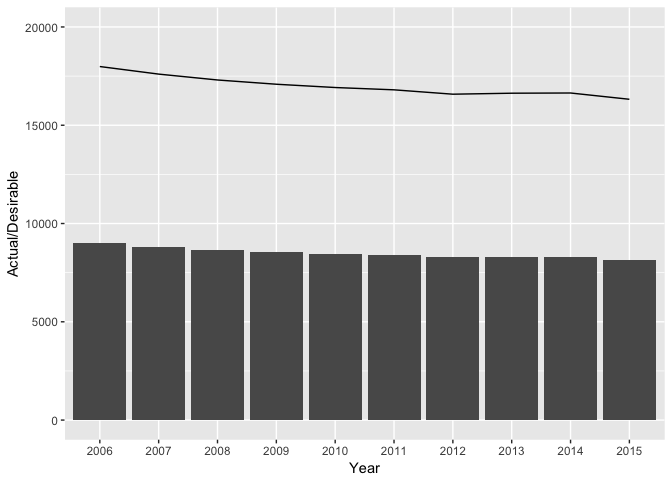

================================================================================

Project 4 - Prosper Loan Data - Myles Callan
--------------------------------------------

================================================================================

``` r
library(ggplot2)
ggplot(data = baba, aes(x = Year,y = Actual)) +   geom_bar(stat="Identity") +   
  geom_line(aes(x = Year, y = Desirable), data= baba) + 
  ylab("Actual/Desirable")
```


``` r

ggplot(data = baba, aes(x = Year,y = Actual)) +   geom_bar(stat="Identity") +   
  geom_line(aes(y = Desirable)) +   ylab("Actual/Desirable")
```



``` r

a <- baba

a$Year <- as.factor(a$Year)
a
#>    row Year Actual Desirable
#> 1    1 2006 8993.8   17987.6
#> 2    2 2007 8800.9   17601.8
#> 3    3 2008 8651.3   17302.6
#> 4    4 2009 8543.3   17086.6
#> 5    5 2010 8459.7   16919.4
#> 6    6 2011 8400.9   16801.8
#> 7    7 2012 8289.8   16579.6
#> 8    8 2013 8314.9   16629.8
#> 9    9 2014 8320.4   16640.8
#> 10  10 2015 8160.5   16321.0
ggplot(aes(x = Year, y = Actual), data = a) + scale_y_continuous(limits = c(0, 20000)) + 
geom_bar(stat = "Identity") + 
geom_line(aes(x = Year, y = Desirable,  group = 1), data = a) + ylab("Actual/Desirable")
```



Including Plots
---------------

You can also embed plots, for example:


Note that the `echo = FALSE` parameter was added to the code chunk to prevent printing of the R code that generated the plot.
